<h2>Mapping Objet Relationnel (ORM), JPA, Hibernate, Spring Data</h2>
<h3>Spring Data :</h3>

• Spring Data est un module de Spring qui a déjà créé des interfaces génériques et des implémentations
génériques qui permettent de gérer les entités JPA.  
• En utilisant Spring Data, vous n’aurez plus besoin de faire appel à l’objet EntityManager pour gérer la
persitence. Spring Data le fait à votre place.  
• Spring Data nous évite de créer les interfaces et les implémentation JPA de la couche DAO.  
• Il suffit de créer une interface qui hérite de l’interface JPARepository pour hériter toutes les méthodes
classiques qui permettent de gérer les entités JPA.  
• En cas de besoin, vous avez la possibilité d’ajouter d’autres méthodes en les déclarant à l’intérieur de
l’interface JPARepository, sans avoir besoin de les implémenter. Spring Data le fera à votre place.

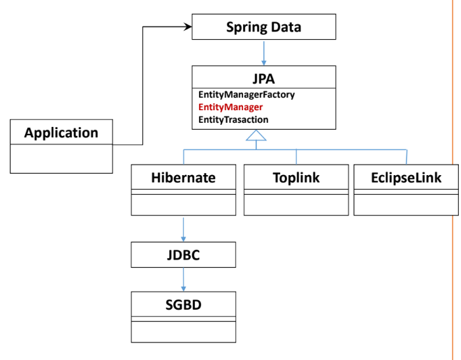

<h3>L'ensemble des Entités JPA :</h3>
<h4>L'Entité Patient : </h4>
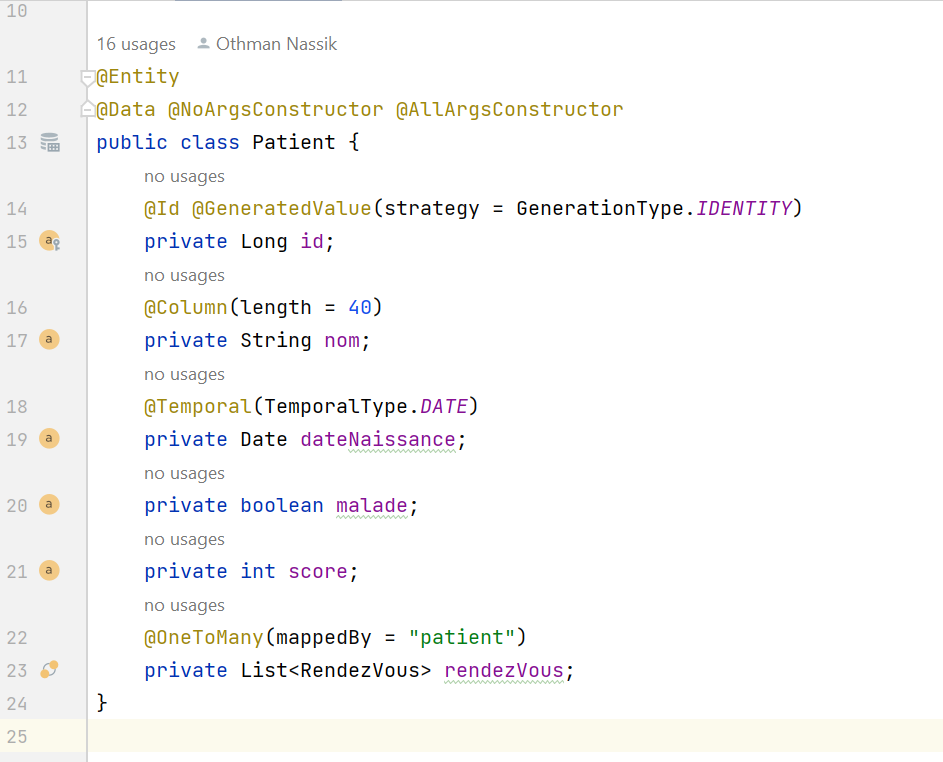

<h4>L'Entité Medecin : </h4>
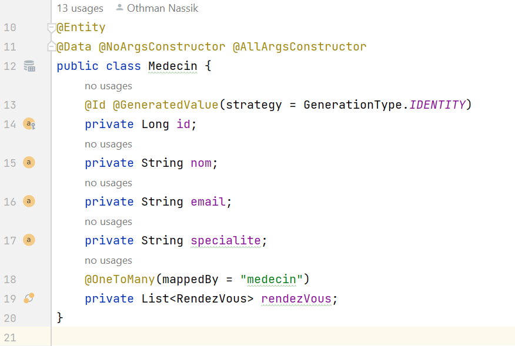

<h4>L'Entité RendezVous : </h4>
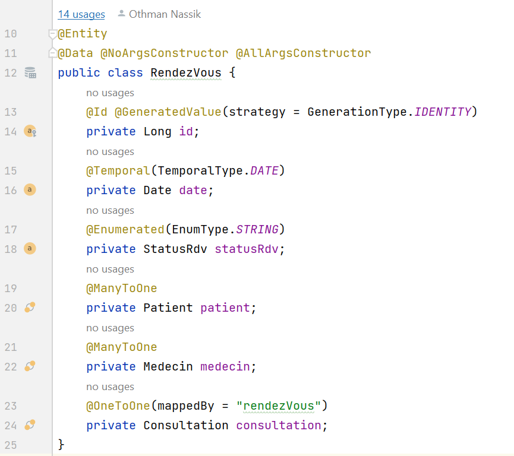

<h4>L'Entité Consultation : </h4>
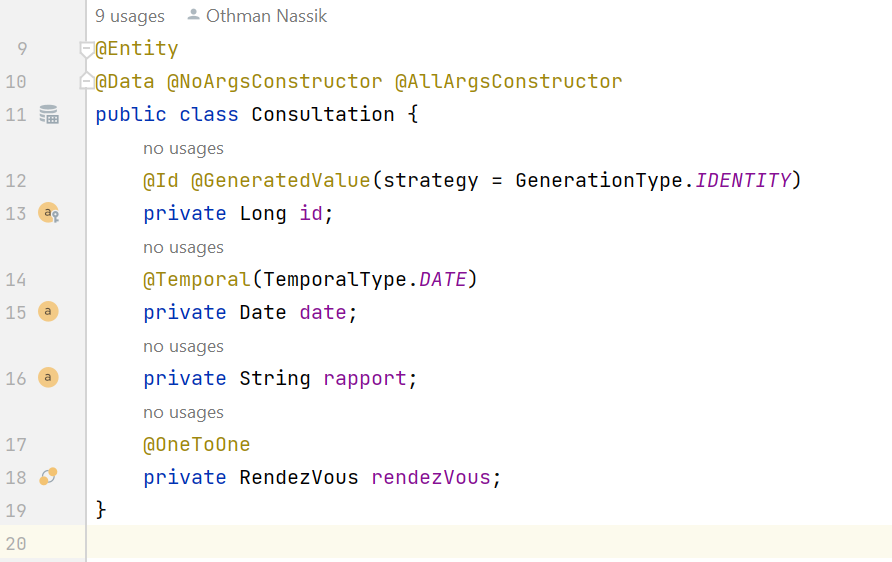

<h4>L'Entité User : </h4>
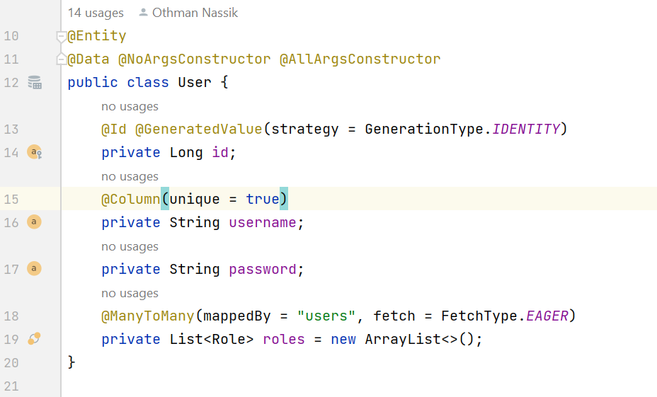

<h4>L'Entité Role : </h4>
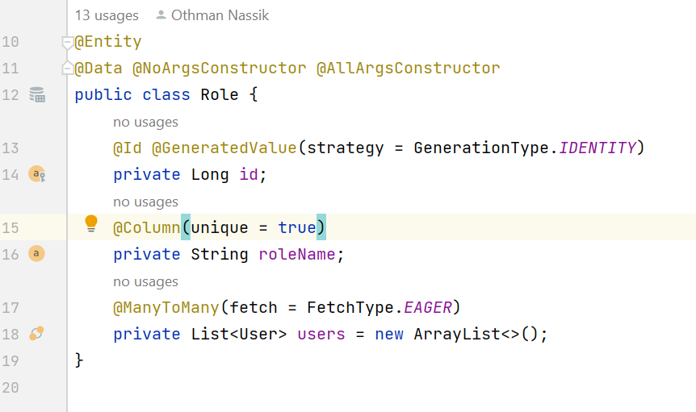

<h3>L'ensemble des Repositories :</h3>
<h4>PatientRepository : </h4>
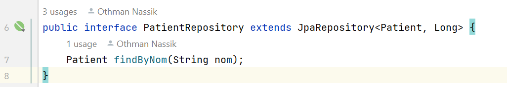

<h4>MedecinRepository : </h4>
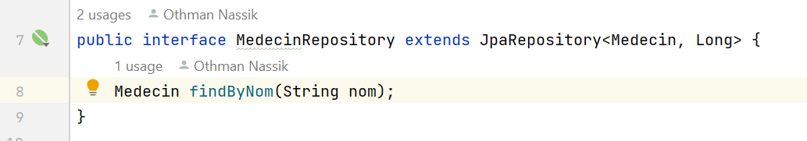

<h4>RendezVousRepository : </h4>
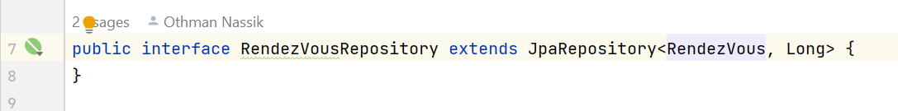

<h4>ConsultationRepository : </h4>
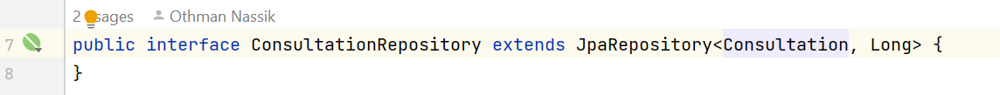

<h4>UserRepository : </h4>
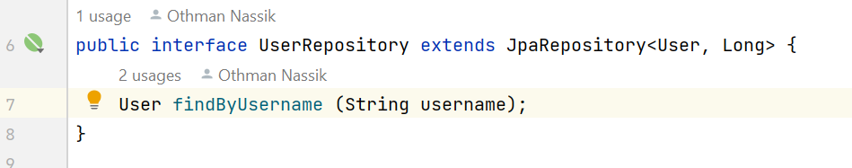

<h4>RoleRepository : </h4>
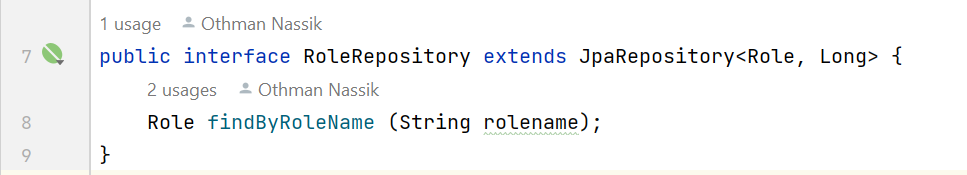

<h3>La Couche Service :</h3>
<h4>L'interface IService :</h4>
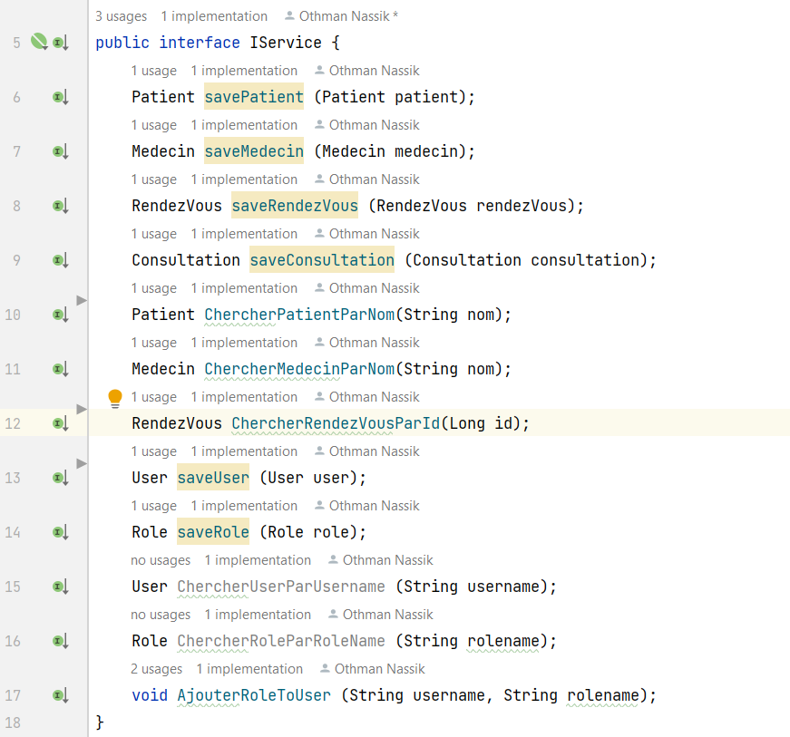

<h4>L'implémentation de L'interface IService :</h4>
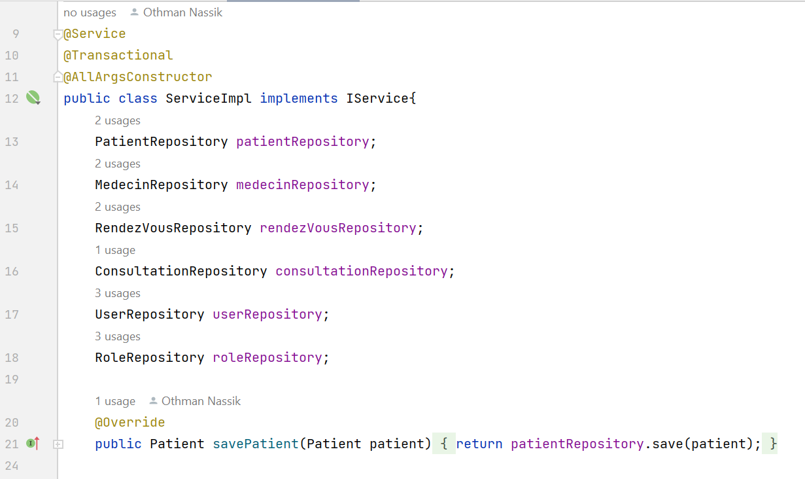
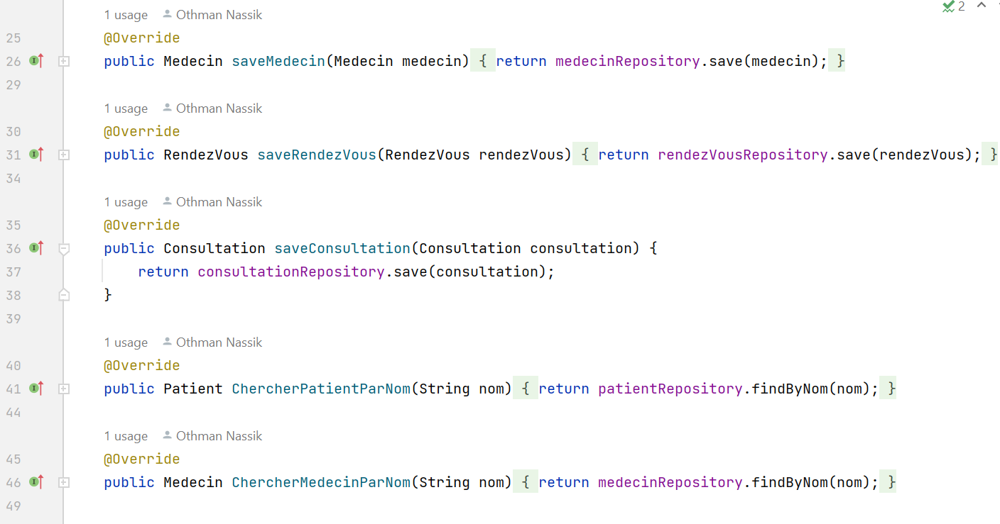
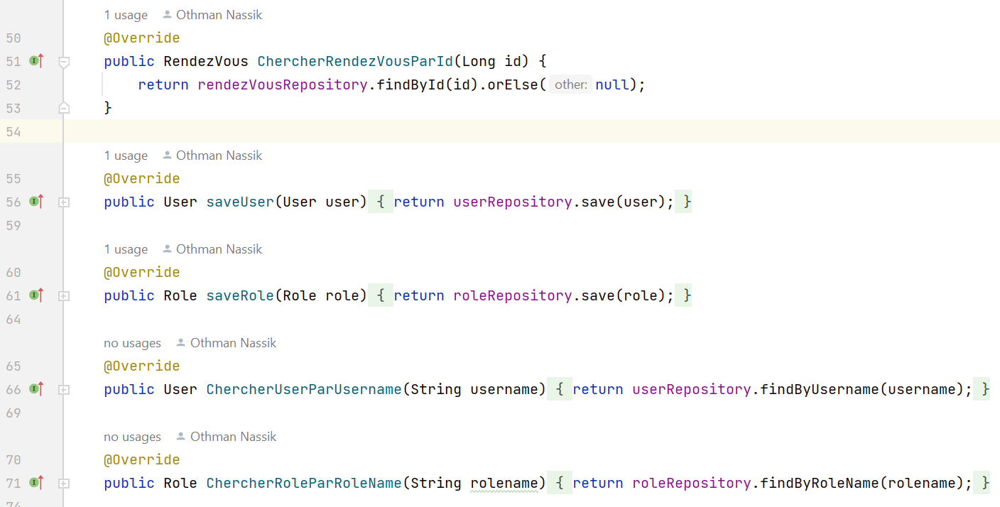
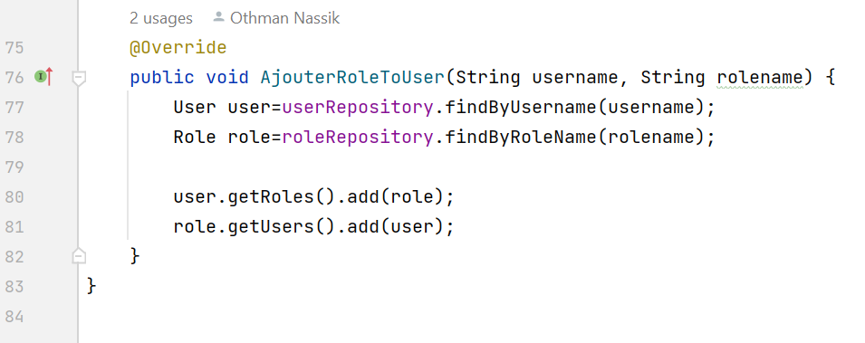

<h4>Test de l'application :</h4>
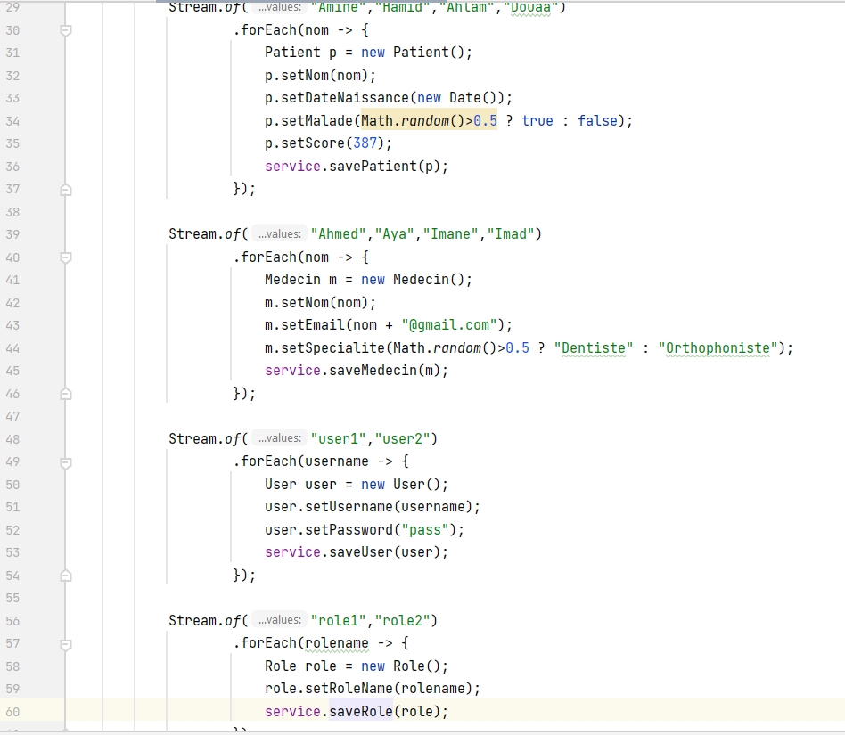
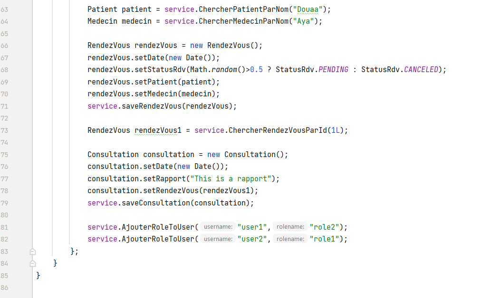
